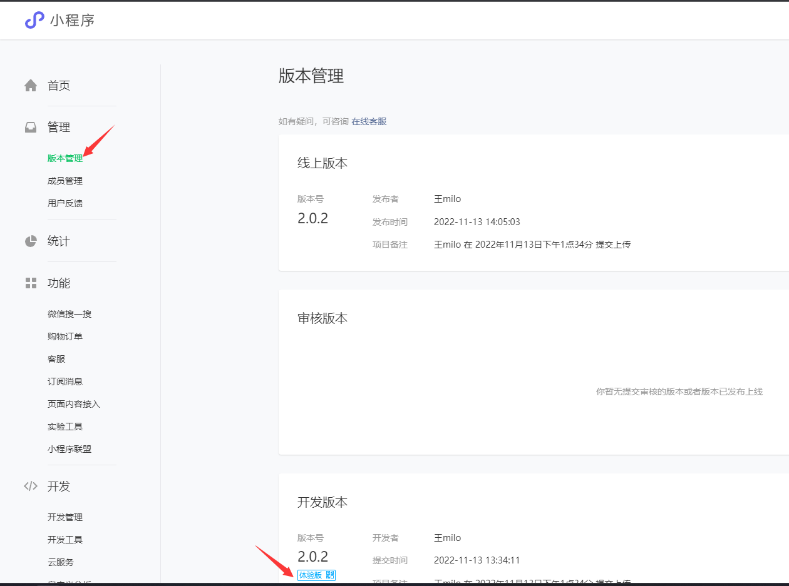

# NWU专属头像小程序

**请在项目根目录下打开本文件，以保证链接的有效性。**

目录：

- [制作流程](#制作流程)
- [发布流程](#发布流程)
- [开发者权限和体验权限](#开发者权限和体验权限)

## 制作流程

1. 制作背景图，`png`格式，尺寸至少为`1080 x 2100`。参考[背景模板.psd](模板/背景模板.psd)
2. 制作头像框，`png`格式，尺寸必须**严格**限制为`1024 x 1024`。参考[头像框模板.psd](模板/头像框模板.psd)
3. 以数字重命名头像框，**严格**从零开始。放入[模板/存储桶模板/borders](模板/存储桶模板/borders)
4. 在之后的步骤中，上传[模板/存储桶模板](模板/存储桶模板)这个文件夹

## 发布流程

1. 安装微信开发者工具https://developers.weixin.qq.com/miniprogram/dev/devtools/download.html

2. 申请开发者权限，具体查看[这个章节](#开发者权限和体验权限)

3. 打开微信开发者工具，登录后导入项目。[项目路径](小程序)

   

4. 购买并配置云开发环境：

   1. 打开云开发控制台

      

   2. 购买并开通环境，环境名称可以自由填写；云环境过期后小程序将无法正常工作。

   3. 找到配置文件，并修改对应的云环境id

      

   4. 上传存储桶资源，选择制作好的[模板/存储桶模板](模板/存储桶模板)文件夹

      

   5. 复制文件链接

      

   6. 配置全局背景图片：

      

5. 测试：

   

6. 上传体验版：

   

7. 获取体验版链接，在不同机型上测试：

   

8. 测试没有问题后，提交审核并发布：

   

9. 等待十分钟左右，就可以上线了。

## 开发者权限和体验权限

小程序控制台：https://mp.weixin.qq.com/

- 小程序权限分为以下三种：
  - 管理员：只有一人，最高权限，完全控制小程序，需要定期更换（或由团委老师担任）
  - 项目成员：即开发者，可以修改、上传代码，可以找信科院或是计算机协会相关同学。修改项目成员需要管理员确认。
  - 体验成员：此名单内的成员可以使用体验版小程序。修改此名单只需要项目成员确认。